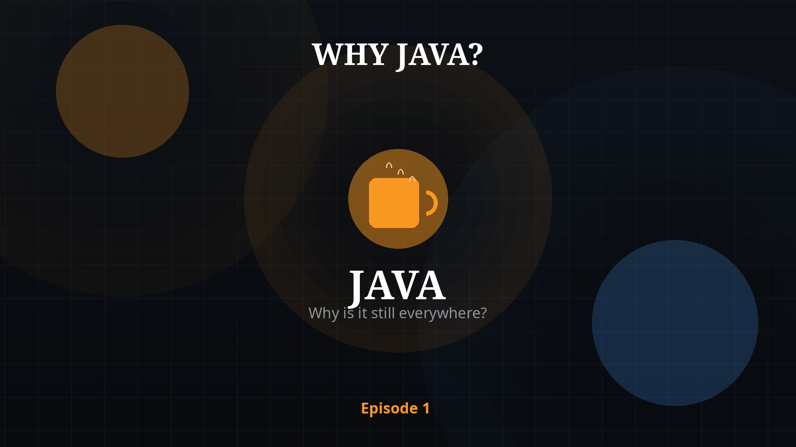

# Episode 01 — Why Java Exists / Introduction to Java

**Cut:** `v1` · **Series:** The Java Story

## Files

- [`thumbnail.jpg`](thumbnail.jpg) — episode thumbnail
- [`Java_Episode_01_Why_Java_Exists.mp4`](Java_Episode_01_Why_Java_Exists.mp4) — clean video
- [`Java_Episode_01_Why_Java_Exists_CAPTIONED.mp4`](Java_Episode_01_Why_Java_Exists_CAPTIONED.mp4) — captioned video
- [`Java_Episode_01.srt`](Java_Episode_01.srt) — captions (SRT)
- [`production_bible.md`](production_bible.md) — production bible

## Navigation

- Next: [Episode 02 — JDK, JRE, and JVM](../ep02-jdk-jre-and-jvm/)
- Index: [`../../INDEX.md`](../../INDEX.md)
