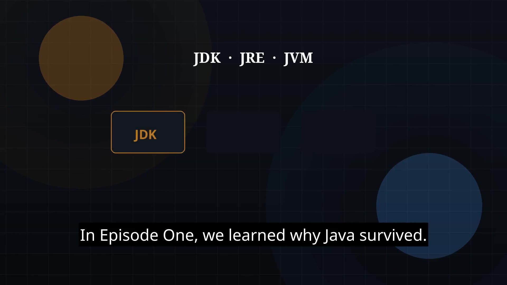

# Episode 02 — JDK, JRE, and JVM

**Cut:** `v1` · **Series:** The Java Story

## Files

- [`thumbnail.jpg`](thumbnail.jpg) — episode thumbnail
- [`Java_Episode_02_JDK_JRE_JVM.mp4`](Java_Episode_02_JDK_JRE_JVM.mp4) — clean video
- [`Java_Episode_02_JDK_JRE_JVM_CAPTIONED.mp4`](Java_Episode_02_JDK_JRE_JVM_CAPTIONED.mp4) — captioned video
- [`Java_Episode_02.srt`](Java_Episode_02.srt) — captions (SRT)

## Navigation

- Previous: [Episode 01 — Why Java Exists / Introduction to Java](../ep01-why-java-exists-introduction-to-java/)
- Next: [Episode 03 — Java Program Structure](../ep03-java-program-structure/)
- Index: [`../../INDEX.md`](../../INDEX.md)
