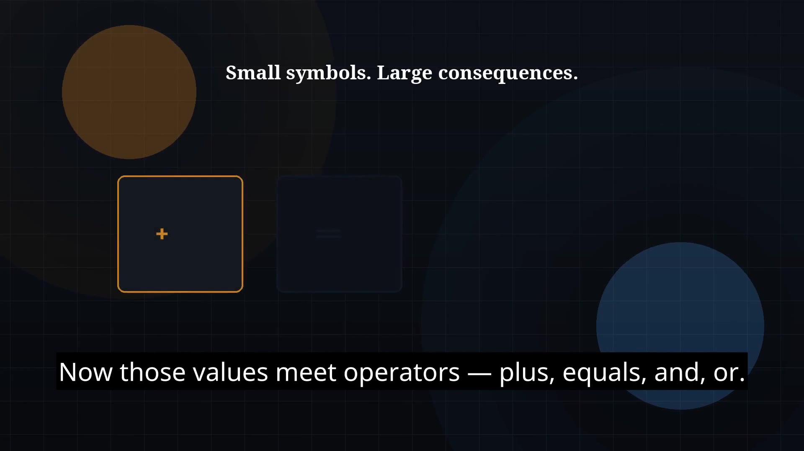

# Episode 05 — Operators

**Cut:** `v1` · **Series:** The Java Story

## Files

- [`thumbnail.jpg`](thumbnail.jpg) — episode thumbnail
- [`Java_Episode_05_Operators.mp4`](Java_Episode_05_Operators.mp4) — clean video
- [`Java_Episode_05_Operators_CAPTIONED.mp4`](Java_Episode_05_Operators_CAPTIONED.mp4) — captioned video
- [`Java_Episode_05.srt`](Java_Episode_05.srt) — captions (SRT)

## Navigation

- Previous: [Episode 04 — Variables and Data Types](../ep04-variables-and-data-types/)
- Next: [Episode 06 — Control Flow](../ep06-control-flow/)
- Index: [`../../INDEX.md`](../../INDEX.md)
