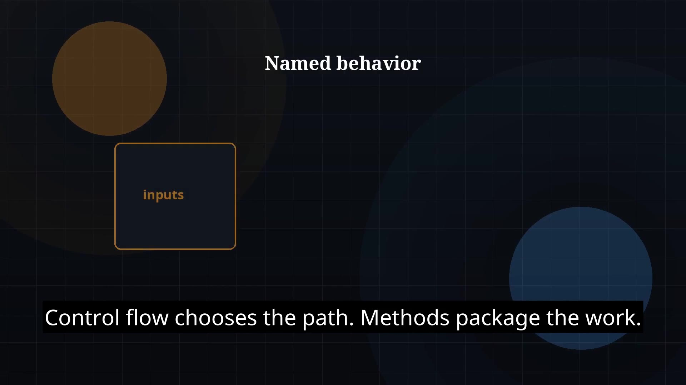

# Episode 07 — Methods

**Cut:** `v1` · **Series:** The Java Story

## Files

- [`thumbnail.jpg`](thumbnail.jpg) — episode thumbnail
- [`Java_Episode_07_Methods.mp4`](Java_Episode_07_Methods.mp4) — clean video
- [`Java_Episode_07_Methods_CAPTIONED.mp4`](Java_Episode_07_Methods_CAPTIONED.mp4) — captioned video
- [`Java_Episode_07.srt`](Java_Episode_07.srt) — captions (SRT)

## Navigation

- Previous: [Episode 06 — Control Flow](../ep06-control-flow/)
- Next: [Episode 08 — Arrays](../ep08-arrays/)
- Index: [`../../INDEX.md`](../../INDEX.md)
