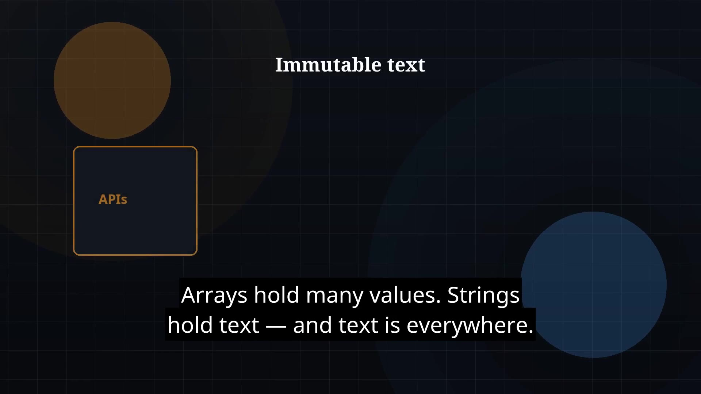

# Episode 09 — Strings

**Cut:** `v1` · **Series:** The Java Story

## Files

- [`thumbnail.jpg`](thumbnail.jpg) — episode thumbnail
- [`Java_Episode_09_Strings.mp4`](Java_Episode_09_Strings.mp4) — clean video
- [`Java_Episode_09_Strings_CAPTIONED.mp4`](Java_Episode_09_Strings_CAPTIONED.mp4) — captioned video
- [`Java_Episode_09.srt`](Java_Episode_09.srt) — captions (SRT)

## Navigation

- Previous: [Episode 08 — Arrays](../ep08-arrays/)
- Next: [Episode 10 — Object-Oriented Programming](../ep10-object-oriented-programming/)
- Index: [`../../INDEX.md`](../../INDEX.md)
