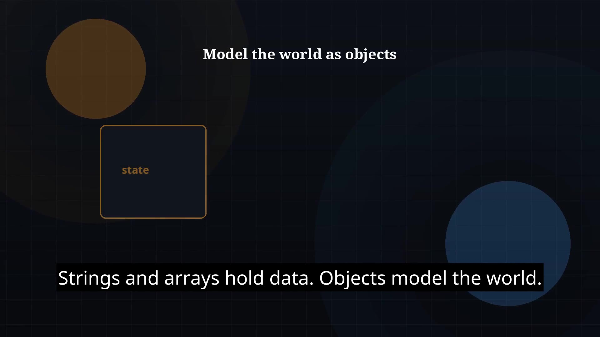

# Episode 10 — Object-Oriented Programming

**Cut:** `v1` · **Series:** The Java Story

## Files

- [`thumbnail.jpg`](thumbnail.jpg) — episode thumbnail
- [`Java_Episode_10_OOP.mp4`](Java_Episode_10_OOP.mp4) — clean video
- [`Java_Episode_10_OOP_CAPTIONED.mp4`](Java_Episode_10_OOP_CAPTIONED.mp4) — captioned video
- [`Java_Episode_10.srt`](Java_Episode_10.srt) — captions (SRT)

## Navigation

- Previous: [Episode 09 — Strings](../ep09-strings/)
- Next: [Episode 11 — Access Modifiers](../ep11-access-modifiers/)
- Index: [`../../INDEX.md`](../../INDEX.md)
