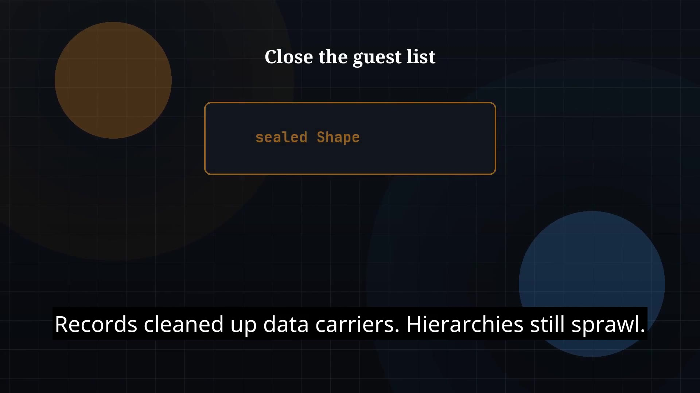

# Episode 19 — Sealed Classes

**Cut:** `v1` · **Series:** The Java Story

## Files

- [`thumbnail.jpg`](thumbnail.jpg) — episode thumbnail
- [`Java_Episode_19_Sealed_Classes.mp4`](Java_Episode_19_Sealed_Classes.mp4) — clean video
- [`Java_Episode_19_Sealed_Classes_CAPTIONED.mp4`](Java_Episode_19_Sealed_Classes_CAPTIONED.mp4) — captioned video
- [`Java_Episode_19.srt`](Java_Episode_19.srt) — captions (SRT)

## Navigation

- Previous: [Episode 18 — Records](../ep18-records/)
- Next: [Episode 20 — Modules and JPMS](../ep20-modules-and-jpms/)
- Index: [`../../INDEX.md`](../../INDEX.md)
