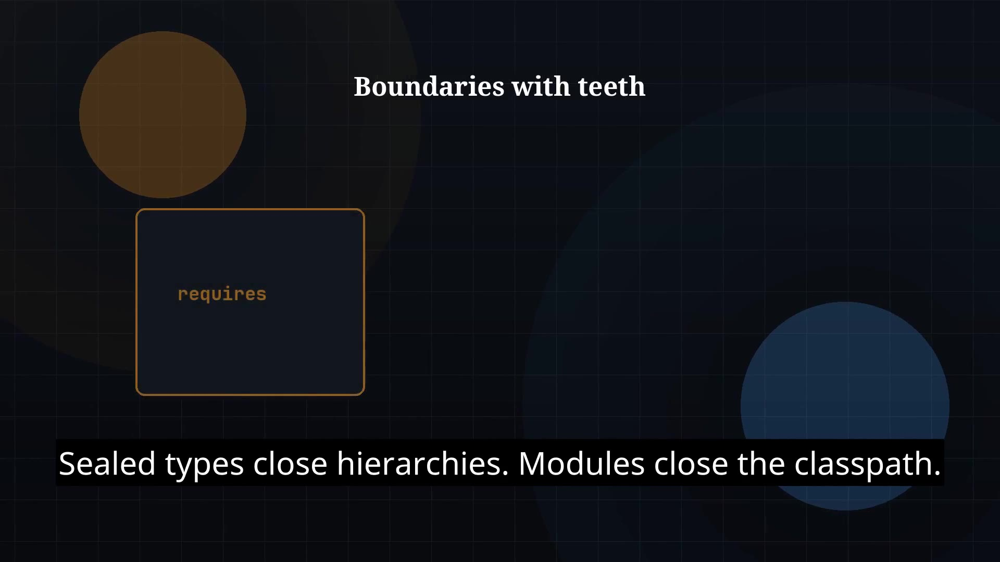

# Episode 20 — Modules and JPMS

**Cut:** `v1` · **Series:** The Java Story

## Files

- [`thumbnail.jpg`](thumbnail.jpg) — episode thumbnail
- [`Java_Episode_20_Modules_JPMS.mp4`](Java_Episode_20_Modules_JPMS.mp4) — clean video
- [`Java_Episode_20_Modules_JPMS_CAPTIONED.mp4`](Java_Episode_20_Modules_JPMS_CAPTIONED.mp4) — captioned video
- [`Java_Episode_20.srt`](Java_Episode_20.srt) — captions (SRT)

## Navigation

- Previous: [Episode 19 — Sealed Classes](../ep19-sealed-classes/)
- Next: [Episode 21 — Lists](../ep21-lists/)
- Index: [`../../INDEX.md`](../../INDEX.md)
