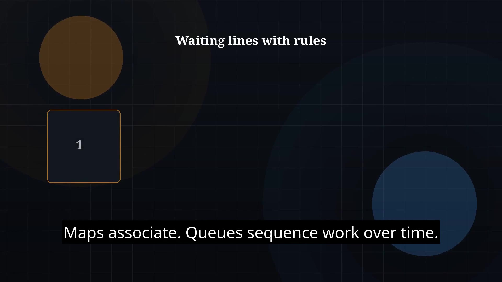

# Episode 24 — Queues and Deques

**Cut:** `v1` · **Series:** The Java Story

## Files

- [`thumbnail.jpg`](thumbnail.jpg) — episode thumbnail
- [`Java_Episode_24_Queues_Deques.mp4`](Java_Episode_24_Queues_Deques.mp4) — clean video
- [`Java_Episode_24_Queues_Deques_CAPTIONED.mp4`](Java_Episode_24_Queues_Deques_CAPTIONED.mp4) — captioned video
- [`Java_Episode_24.srt`](Java_Episode_24.srt) — captions (SRT)

## Navigation

- Previous: [Episode 23 — Maps](../ep23-maps/)
- Next: [Episode 25 — Sorting and Comparators](../ep25-sorting-and-comparators/)
- Index: [`../../INDEX.md`](../../INDEX.md)
