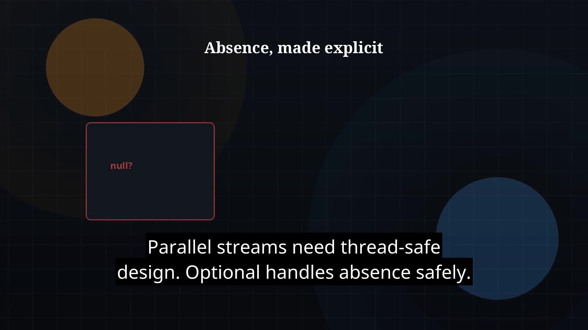

# Episode 30 — Optional

**Cut:** `v1` · **Series:** The Java Story

## Files

- [`thumbnail.jpg`](thumbnail.jpg) — episode thumbnail
- [`Java_Episode_30_Optional.mp4`](Java_Episode_30_Optional.mp4) — clean video
- [`Java_Episode_30_Optional_CAPTIONED.mp4`](Java_Episode_30_Optional_CAPTIONED.mp4) — captioned video
- [`Java_Episode_30.srt`](Java_Episode_30.srt) — captions (SRT)

## Navigation

- Previous: [Episode 29 — Parallel Streams](../ep29-parallel-streams/)
- Next: [Episode 31 — java.time](../ep31-java-time/)
- Index: [`../../INDEX.md`](../../INDEX.md)
