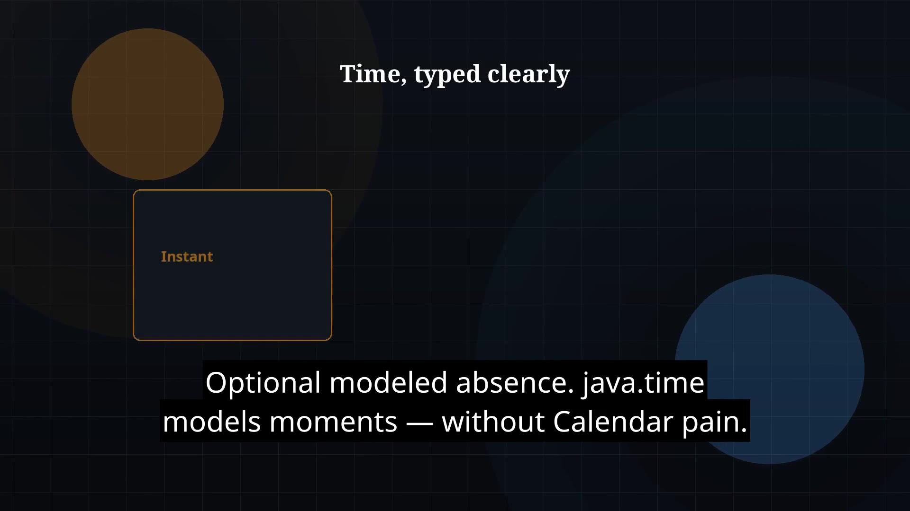

# Episode 31 — java.time

**Cut:** `v1` · **Series:** The Java Story

## Files

- [`thumbnail.jpg`](thumbnail.jpg) — episode thumbnail
- [`Java_Episode_31_Java_Time.mp4`](Java_Episode_31_Java_Time.mp4) — clean video
- [`Java_Episode_31_Java_Time_CAPTIONED.mp4`](Java_Episode_31_Java_Time_CAPTIONED.mp4) — captioned video
- [`Java_Episode_31.srt`](Java_Episode_31.srt) — captions (SRT)

## Navigation

- Previous: [Episode 30 — Optional](../ep30-optional/)
- Next: [Episode 32 — Exceptions](../ep32-exceptions/)
- Index: [`../../INDEX.md`](../../INDEX.md)
