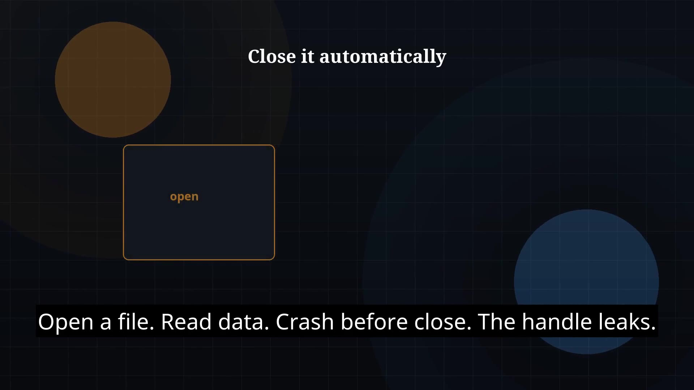

# Episode 33 — try-with-resources

**Cut:** `v1` · **Series:** The Java Story

## Files

- [`thumbnail.jpg`](thumbnail.jpg) — episode thumbnail
- [`Java_Episode_33_Try_With_Resources.mp4`](Java_Episode_33_Try_With_Resources.mp4) — clean video
- [`Java_Episode_33_Try_With_Resources_CAPTIONED.mp4`](Java_Episode_33_Try_With_Resources_CAPTIONED.mp4) — captioned video
- [`Java_Episode_33.srt`](Java_Episode_33.srt) — captions (SRT)

## Navigation

- Previous: [Episode 32 — Exceptions](../ep32-exceptions/)
- Next: [Episode 34 — Files and NIO.2](../ep34-files-and-nio-2/)
- Index: [`../../INDEX.md`](../../INDEX.md)
