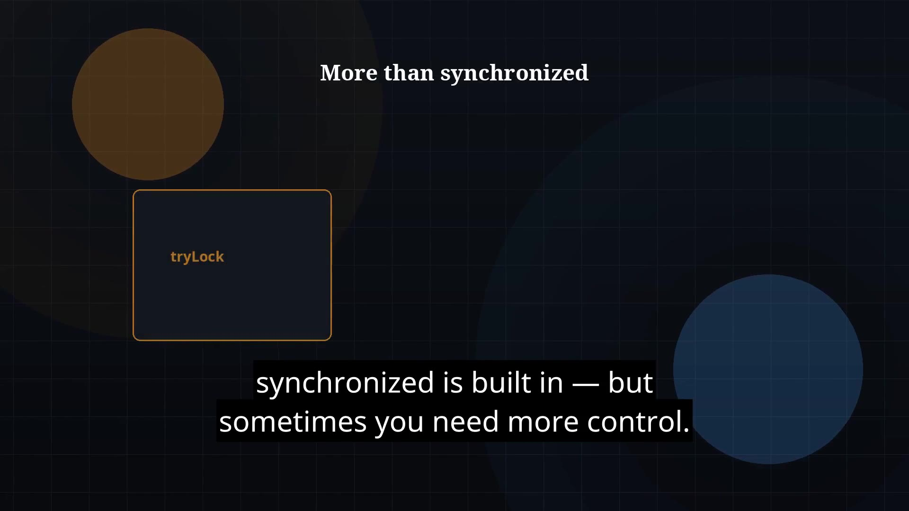

# Episode 39 — Explicit Locks

**Cut:** `v1` · **Series:** The Java Story

## Files

- [`thumbnail.jpg`](thumbnail.jpg) — episode thumbnail
- [`Java_Episode_39_Explicit_Locks.mp4`](Java_Episode_39_Explicit_Locks.mp4) — clean video
- [`Java_Episode_39_Explicit_Locks_CAPTIONED.mp4`](Java_Episode_39_Explicit_Locks_CAPTIONED.mp4) — captioned video
- [`Java_Episode_39.srt`](Java_Episode_39.srt) — captions (SRT)

## Navigation

- Previous: [Episode 38 — volatile and Happens-Before](../ep38-volatile-and-happens-before/)
- Next: [Episode 40 — ExecutorService](../ep40-executorservice/)
- Index: [`../../INDEX.md`](../../INDEX.md)
