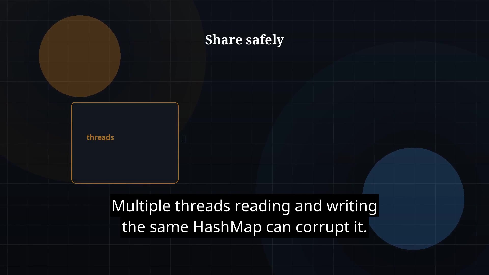

# Episode 42 — Concurrent Collections

**Cut:** `v1` · **Series:** The Java Story

## Files

- [`thumbnail.jpg`](thumbnail.jpg) — episode thumbnail
- [`Java_Episode_42_Concurrent_Collections.mp4`](Java_Episode_42_Concurrent_Collections.mp4) — clean video
- [`Java_Episode_42_Concurrent_Collections_CAPTIONED.mp4`](Java_Episode_42_Concurrent_Collections_CAPTIONED.mp4) — captioned video
- [`Java_Episode_42.srt`](Java_Episode_42.srt) — captions (SRT)

## Navigation

- Previous: [Episode 41 — Callable and Future](../ep41-callable-and-future/)
- Next: [Episode 43 — Atomics](../ep43-atomics/)
- Index: [`../../INDEX.md`](../../INDEX.md)
