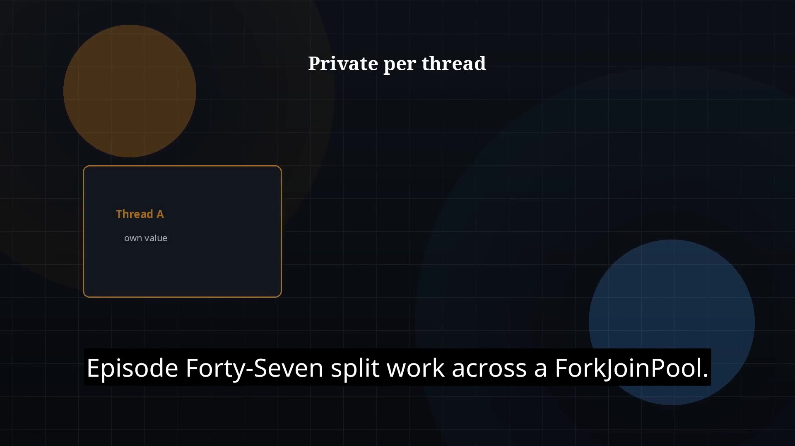

# Episode 48 — ThreadLocal

**Cut:** `v1` · **Series:** The Java Story

## Files

- [`thumbnail.jpg`](thumbnail.jpg) — episode thumbnail
- [`Java_Episode_48_ThreadLocal.mp4`](Java_Episode_48_ThreadLocal.mp4) — clean video
- [`Java_Episode_48_ThreadLocal_CAPTIONED.mp4`](Java_Episode_48_ThreadLocal_CAPTIONED.mp4) — captioned video
- [`Java_Episode_48.srt`](Java_Episode_48.srt) — captions (SRT)

## Navigation

- Previous: [Episode 47 — ForkJoinPool](../ep47-forkjoinpool/)
- Next: [Episode 49 — Deadlocks](../ep49-deadlocks/)
- Index: [`../../INDEX.md`](../../INDEX.md)
