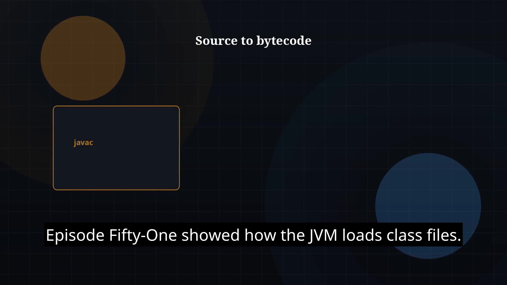

# Episode 52 — Bytecode Basics

**Cut:** `v1` · **Series:** The Java Story

## Files

- [`thumbnail.jpg`](thumbnail.jpg) — episode thumbnail
- [`Java_Episode_52_Bytecode_Basics.mp4`](Java_Episode_52_Bytecode_Basics.mp4) — clean video
- [`Java_Episode_52_Bytecode_Basics_CAPTIONED.mp4`](Java_Episode_52_Bytecode_Basics_CAPTIONED.mp4) — captioned video
- [`Java_Episode_52.srt`](Java_Episode_52.srt) — captions (SRT)

## Navigation

- Previous: [Episode 51 — Class Loading](../ep51-class-loading/)
- Next: [Episode 53 — Heap and Stack](../ep53-heap-and-stack/)
- Index: [`../../INDEX.md`](../../INDEX.md)
