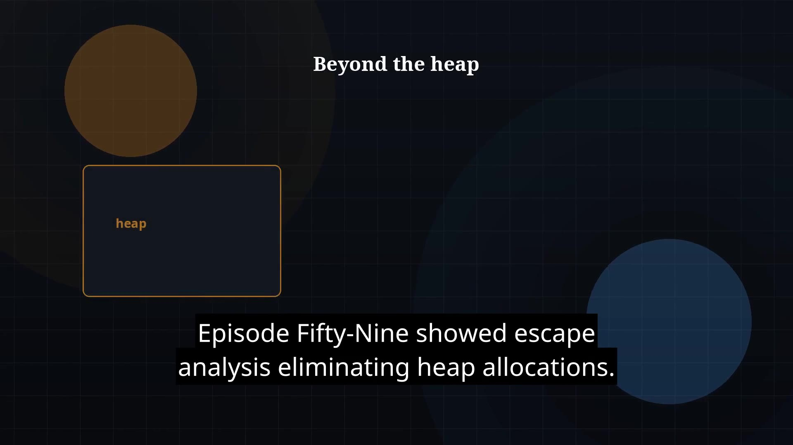

# Episode 60 — Metaspace and Native Memory

**Cut:** `v1` · **Series:** The Java Story

## Files

- [`thumbnail.jpg`](thumbnail.jpg) — episode thumbnail
- [`Java_Episode_60_Metaspace_Native_Memory.mp4`](Java_Episode_60_Metaspace_Native_Memory.mp4) — clean video
- [`Java_Episode_60_Metaspace_Native_Memory_CAPTIONED.mp4`](Java_Episode_60_Metaspace_Native_Memory_CAPTIONED.mp4) — captioned video
- [`Java_Episode_60.srt`](Java_Episode_60.srt) — captions (SRT)

## Navigation

- Previous: [Episode 59 — Escape Analysis](../ep59-escape-analysis/)
- Next: [Episode 61 — Reference Types](../ep61-reference-types/)
- Index: [`../../INDEX.md`](../../INDEX.md)
