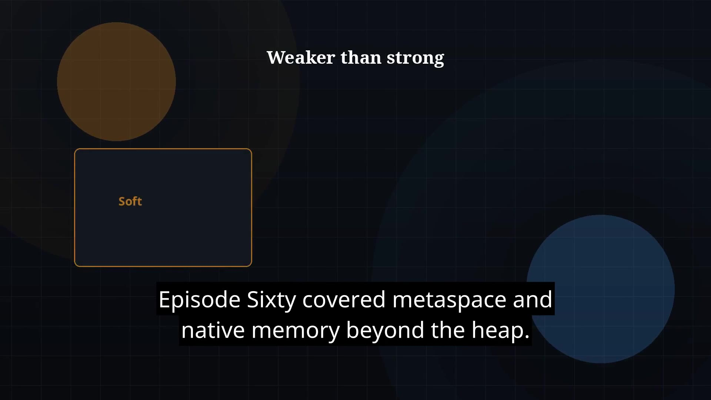

# Episode 61 — Reference Types

**Cut:** `v1` · **Series:** The Java Story

## Files

- [`thumbnail.jpg`](thumbnail.jpg) — episode thumbnail
- [`Java_Episode_61_Reference_Types.mp4`](Java_Episode_61_Reference_Types.mp4) — clean video
- [`Java_Episode_61_Reference_Types_CAPTIONED.mp4`](Java_Episode_61_Reference_Types_CAPTIONED.mp4) — captioned video
- [`Java_Episode_61.srt`](Java_Episode_61.srt) — captions (SRT)

## Navigation

- Previous: [Episode 60 — Metaspace and Native Memory](../ep60-metaspace-and-native-memory/)
- Next: [Episode 62 — JVM Flags and Tuning](../ep62-jvm-flags-and-tuning/)
- Index: [`../../INDEX.md`](../../INDEX.md)
