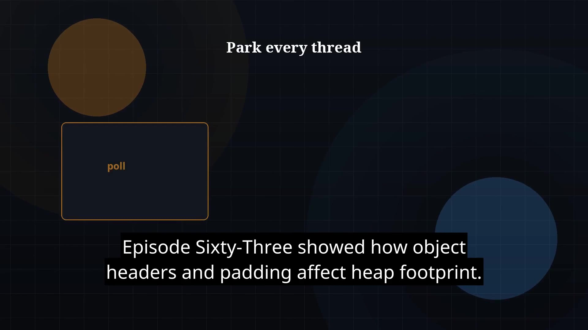

# Episode 64 — Safepoints

**Cut:** `v1` · **Series:** The Java Story

## Files

- [`thumbnail.jpg`](thumbnail.jpg) — episode thumbnail
- [`Java_Episode_64_Safepoints.mp4`](Java_Episode_64_Safepoints.mp4) — clean video
- [`Java_Episode_64_Safepoints_CAPTIONED.mp4`](Java_Episode_64_Safepoints_CAPTIONED.mp4) — captioned video
- [`Java_Episode_64.srt`](Java_Episode_64.srt) — captions (SRT)

## Navigation

- Previous: [Episode 63 — Object Layout](../ep63-object-layout/)
- Next: [Episode 65 — JVM Startup](../ep65-jvm-startup/)
- Index: [`../../INDEX.md`](../../INDEX.md)
