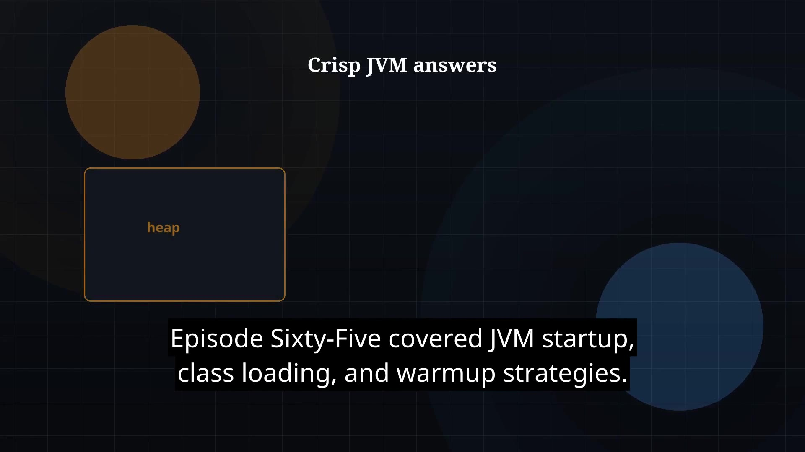

# Episode 66 — JVM Interview Wrap

**Cut:** `v1` · **Series:** The Java Story

## Files

- [`thumbnail.jpg`](thumbnail.jpg) — episode thumbnail
- [`Java_Episode_66_JVM_Interview_Wrap.mp4`](Java_Episode_66_JVM_Interview_Wrap.mp4) — clean video
- [`Java_Episode_66_JVM_Interview_Wrap_CAPTIONED.mp4`](Java_Episode_66_JVM_Interview_Wrap_CAPTIONED.mp4) — captioned video
- [`Java_Episode_66.srt`](Java_Episode_66.srt) — captions (SRT)

## Navigation

- Previous: [Episode 65 — JVM Startup](../ep65-jvm-startup/)
- Next: [Episode 67 — Design Patterns Intro](../ep67-design-patterns-intro/)
- Index: [`../../INDEX.md`](../../INDEX.md)
