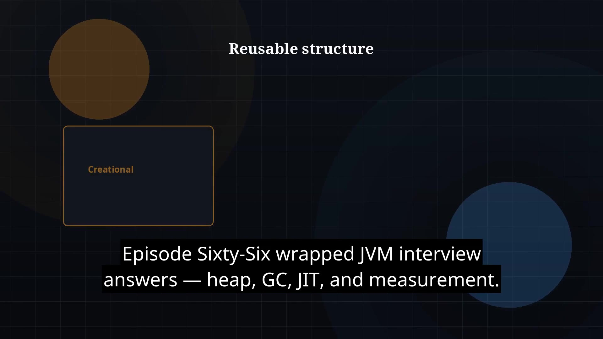

# Episode 67 — Design Patterns Intro

**Cut:** `v1` · **Series:** The Java Story

## Files

- [`thumbnail.jpg`](thumbnail.jpg) — episode thumbnail
- [`Java_Episode_67_Design_Patterns_Intro.mp4`](Java_Episode_67_Design_Patterns_Intro.mp4) — clean video
- [`Java_Episode_67_Design_Patterns_Intro_CAPTIONED.mp4`](Java_Episode_67_Design_Patterns_Intro_CAPTIONED.mp4) — captioned video
- [`Java_Episode_67.srt`](Java_Episode_67.srt) — captions (SRT)

## Navigation

- Previous: [Episode 66 — JVM Interview Wrap](../ep66-jvm-interview-wrap/)
- Next: [Episode 68 — Creational Patterns](../ep68-creational-patterns/)
- Index: [`../../INDEX.md`](../../INDEX.md)
