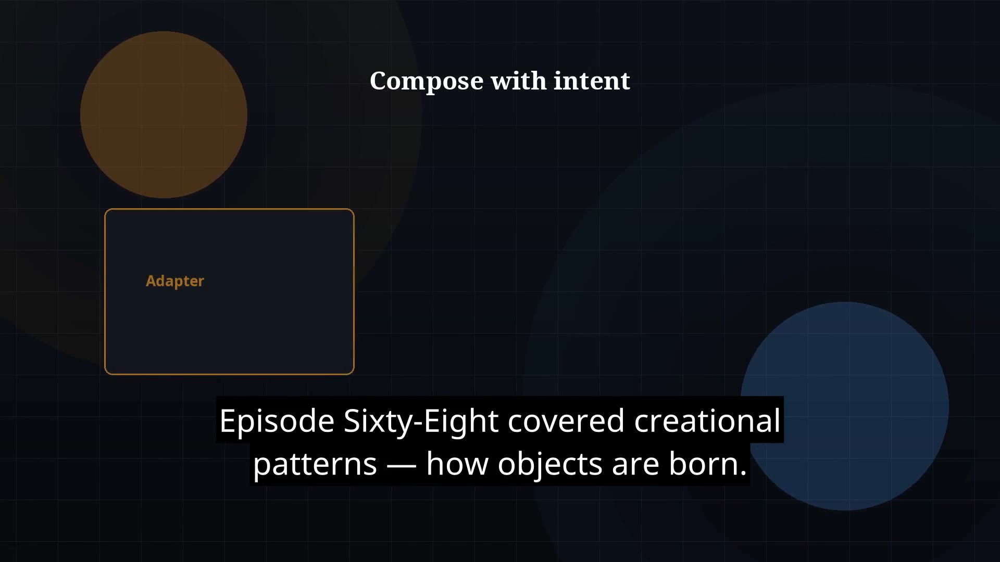

# Episode 69 — Structural Patterns

**Cut:** `v1` · **Series:** The Java Story

## Files

- [`thumbnail.jpg`](thumbnail.jpg) — episode thumbnail
- [`Java_Episode_69_Structural_Patterns.mp4`](Java_Episode_69_Structural_Patterns.mp4) — clean video
- [`Java_Episode_69_Structural_Patterns_CAPTIONED.mp4`](Java_Episode_69_Structural_Patterns_CAPTIONED.mp4) — captioned video
- [`Java_Episode_69.srt`](Java_Episode_69.srt) — captions (SRT)

## Navigation

- Previous: [Episode 68 — Creational Patterns](../ep68-creational-patterns/)
- Next: [Episode 70 — Behavioral Patterns](../ep70-behavioral-patterns/)
- Index: [`../../INDEX.md`](../../INDEX.md)
