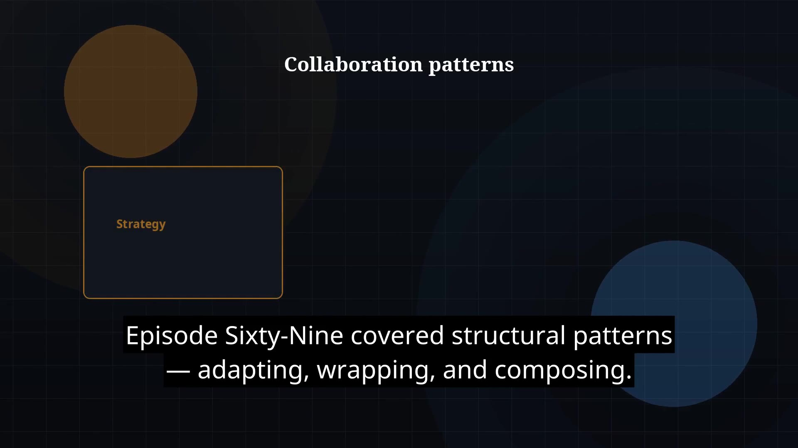

# Episode 70 — Behavioral Patterns

**Cut:** `v1` · **Series:** The Java Story

## Files

- [`thumbnail.jpg`](thumbnail.jpg) — episode thumbnail
- [`Java_Episode_70_Behavioral_Patterns.mp4`](Java_Episode_70_Behavioral_Patterns.mp4) — clean video
- [`Java_Episode_70_Behavioral_Patterns_CAPTIONED.mp4`](Java_Episode_70_Behavioral_Patterns_CAPTIONED.mp4) — captioned video
- [`Java_Episode_70.srt`](Java_Episode_70.srt) — captions (SRT)

## Navigation

- Previous: [Episode 69 — Structural Patterns](../ep69-structural-patterns/)
- Next: [Episode 71 — Spring Framework Intro](../ep71-spring-framework-intro/)
- Index: [`../../INDEX.md`](../../INDEX.md)
