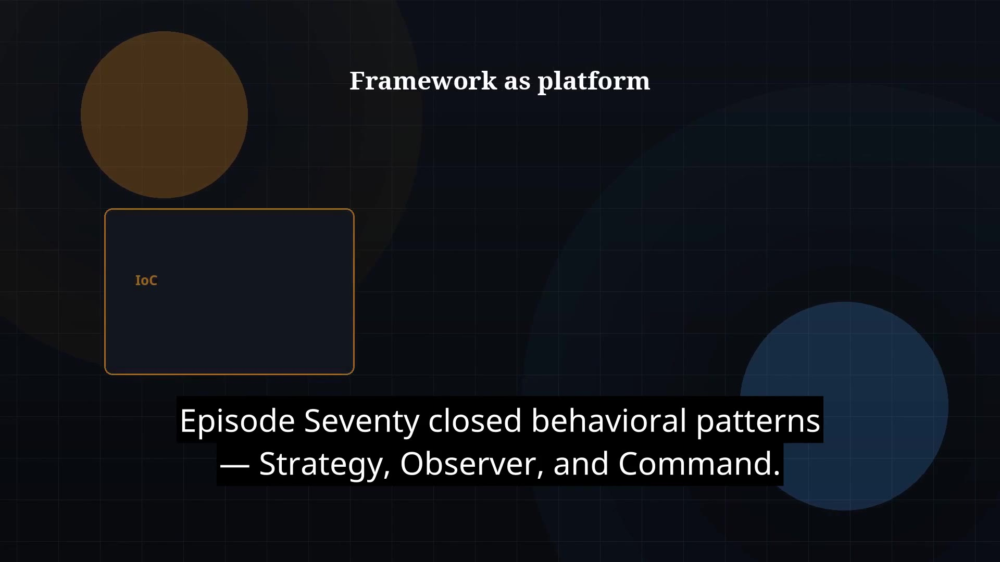

# Episode 71 — Spring Framework Intro

**Cut:** `v1` · **Series:** The Java Story

## Files

- [`thumbnail.jpg`](thumbnail.jpg) — episode thumbnail
- [`Java_Episode_71_Spring_Framework_Intro.mp4`](Java_Episode_71_Spring_Framework_Intro.mp4) — clean video
- [`Java_Episode_71_Spring_Framework_Intro_CAPTIONED.mp4`](Java_Episode_71_Spring_Framework_Intro_CAPTIONED.mp4) — captioned video
- [`Java_Episode_71.srt`](Java_Episode_71.srt) — captions (SRT)

## Navigation

- Previous: [Episode 70 — Behavioral Patterns](../ep70-behavioral-patterns/)
- Next: [Episode 72 — IoC and Dependency Injection](../ep72-ioc-and-dependency-injection/)
- Index: [`../../INDEX.md`](../../INDEX.md)
