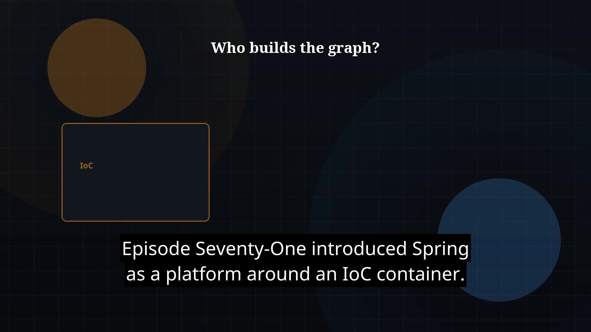

# Episode 72 — IoC and Dependency Injection

**Cut:** `v1` · **Series:** The Java Story

## Files

- [`thumbnail.jpg`](thumbnail.jpg) — episode thumbnail
- [`Java_Episode_72_IoC_and_DI.mp4`](Java_Episode_72_IoC_and_DI.mp4) — clean video
- [`Java_Episode_72_IoC_and_DI_CAPTIONED.mp4`](Java_Episode_72_IoC_and_DI_CAPTIONED.mp4) — captioned video
- [`Java_Episode_72.srt`](Java_Episode_72.srt) — captions (SRT)

## Navigation

- Previous: [Episode 71 — Spring Framework Intro](../ep71-spring-framework-intro/)
- Next: [Episode 73 — Spring Boot Basics](../ep73-spring-boot-basics/)
- Index: [`../../INDEX.md`](../../INDEX.md)
