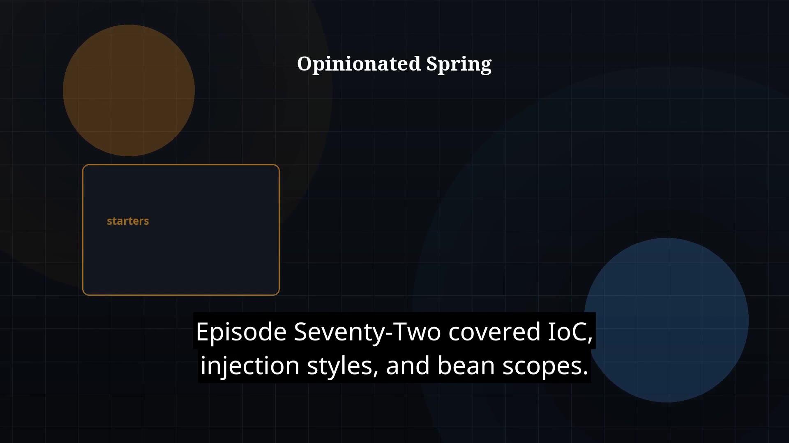

# Episode 73 — Spring Boot Basics

**Cut:** `v1` · **Series:** The Java Story

## Files

- [`thumbnail.jpg`](thumbnail.jpg) — episode thumbnail
- [`Java_Episode_73_Spring_Boot_Basics.mp4`](Java_Episode_73_Spring_Boot_Basics.mp4) — clean video
- [`Java_Episode_73_Spring_Boot_Basics_CAPTIONED.mp4`](Java_Episode_73_Spring_Boot_Basics_CAPTIONED.mp4) — captioned video
- [`Java_Episode_73.srt`](Java_Episode_73.srt) — captions (SRT)

## Navigation

- Previous: [Episode 72 — IoC and Dependency Injection](../ep72-ioc-and-dependency-injection/)
- Next: [Episode 74 — Spring MVC and REST](../ep74-spring-mvc-and-rest/)
- Index: [`../../INDEX.md`](../../INDEX.md)
