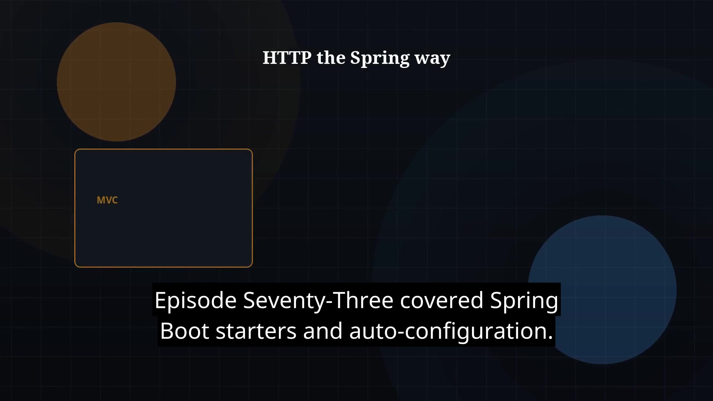

# Episode 74 — Spring MVC and REST

**Cut:** `v1` · **Series:** The Java Story

## Files

- [`thumbnail.jpg`](thumbnail.jpg) — episode thumbnail
- [`Java_Episode_74_Spring_MVC_REST.mp4`](Java_Episode_74_Spring_MVC_REST.mp4) — clean video
- [`Java_Episode_74_Spring_MVC_REST_CAPTIONED.mp4`](Java_Episode_74_Spring_MVC_REST_CAPTIONED.mp4) — captioned video
- [`Java_Episode_74.srt`](Java_Episode_74.srt) — captions (SRT)

## Navigation

- Previous: [Episode 73 — Spring Boot Basics](../ep73-spring-boot-basics/)
- Next: [Episode 75 — Spring Data and Persistence](../ep75-spring-data-and-persistence/)
- Index: [`../../INDEX.md`](../../INDEX.md)
