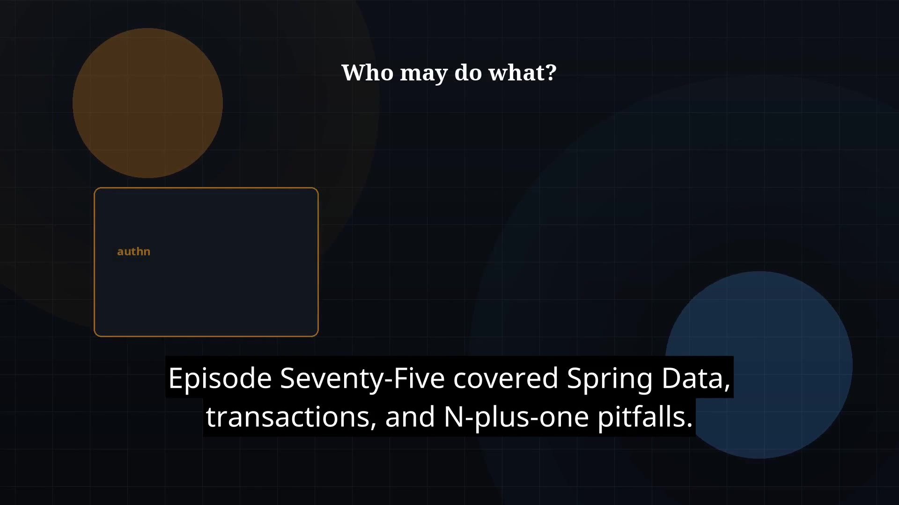

# Episode 76 — Spring Security

**Cut:** `v1` · **Series:** The Java Story

## Files

- [`thumbnail.jpg`](thumbnail.jpg) — episode thumbnail
- [`Java_Episode_76_Spring_Security.mp4`](Java_Episode_76_Spring_Security.mp4) — clean video
- [`Java_Episode_76_Spring_Security_CAPTIONED.mp4`](Java_Episode_76_Spring_Security_CAPTIONED.mp4) — captioned video
- [`Java_Episode_76.srt`](Java_Episode_76.srt) — captions (SRT)

## Navigation

- Previous: [Episode 75 — Spring Data and Persistence](../ep75-spring-data-and-persistence/)
- Next: [Episode 77 — Spring Testing](../ep77-spring-testing/)
- Index: [`../../INDEX.md`](../../INDEX.md)
