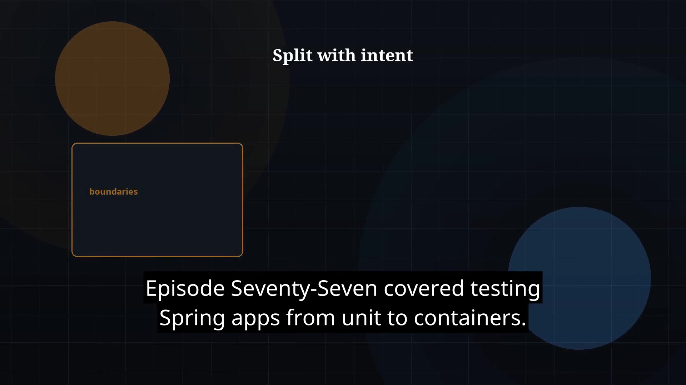

# Episode 78 — Microservices Basics

**Cut:** `v1` · **Series:** The Java Story

## Files

- [`thumbnail.jpg`](thumbnail.jpg) — episode thumbnail
- [`Java_Episode_78_Microservices_Basics.mp4`](Java_Episode_78_Microservices_Basics.mp4) — clean video
- [`Java_Episode_78_Microservices_Basics_CAPTIONED.mp4`](Java_Episode_78_Microservices_Basics_CAPTIONED.mp4) — captioned video
- [`Java_Episode_78.srt`](Java_Episode_78.srt) — captions (SRT)

## Navigation

- Previous: [Episode 77 — Spring Testing](../ep77-spring-testing/)
- Next: [Episode 79 — Observability and Resilience](../ep79-observability-and-resilience/)
- Index: [`../../INDEX.md`](../../INDEX.md)
