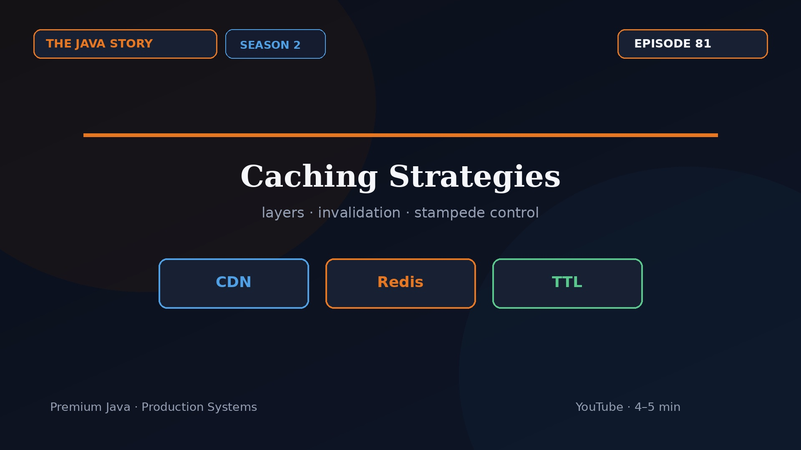

# Episode 81 — Caching Strategies

**Cut:** `v1` · **Series:** The Java Story

## Files

- [`thumbnail.jpg`](thumbnail.jpg) — episode thumbnail
- [`Java_Episode_81_Caching_Strategies.mp4`](Java_Episode_81_Caching_Strategies.mp4) — clean video
- [`Java_Episode_81_Caching_Strategies_CAPTIONED.mp4`](Java_Episode_81_Caching_Strategies_CAPTIONED.mp4) — captioned video
- [`Java_Episode_81.srt`](Java_Episode_81.srt) — captions (SRT)
- [`Java_Episode_81_thumbnail.jpg`](Java_Episode_81_thumbnail.jpg)

## Navigation

- Previous: [Episode 80 — Architecture Interview Wrap](../ep80-architecture-interview-wrap/)
- Next: [Episode 82 — API Design Deep Dive](../ep82-api-design-deep-dive/)
- Index: [`../../INDEX.md`](../../INDEX.md)
