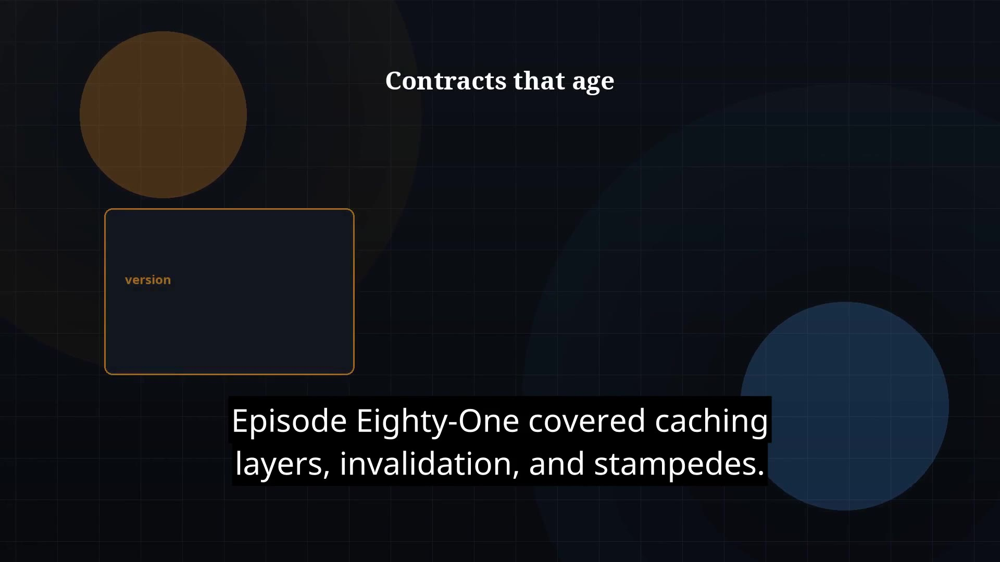

# Episode 82 — API Design Deep Dive

**Cut:** `v1` · **Series:** The Java Story

## Files

- [`thumbnail.jpg`](thumbnail.jpg) — episode thumbnail
- [`Java_Episode_82_API_Design_Deep_Dive.mp4`](Java_Episode_82_API_Design_Deep_Dive.mp4) — clean video
- [`Java_Episode_82_API_Design_Deep_Dive_CAPTIONED.mp4`](Java_Episode_82_API_Design_Deep_Dive_CAPTIONED.mp4) — captioned video
- [`Java_Episode_82.srt`](Java_Episode_82.srt) — captions (SRT)

## Navigation

- Previous: [Episode 81 — Caching Strategies](../ep81-caching-strategies/)
- Next: [Episode 83 — Event-Driven Architecture](../ep83-event-driven-architecture/)
- Index: [`../../INDEX.md`](../../INDEX.md)
