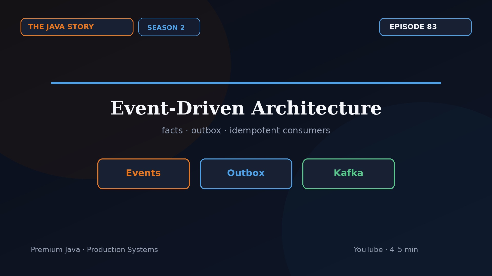

# Episode 83 — Event-Driven Architecture

**Cut:** `v1` · **Series:** The Java Story

## Files

- [`thumbnail.jpg`](thumbnail.jpg) — episode thumbnail
- [`Java_Episode_83_Event_Driven_Architecture.mp4`](Java_Episode_83_Event_Driven_Architecture.mp4) — clean video
- [`Java_Episode_83_Event_Driven_Architecture_CAPTIONED.mp4`](Java_Episode_83_Event_Driven_Architecture_CAPTIONED.mp4) — captioned video
- [`Java_Episode_83.srt`](Java_Episode_83.srt) — captions (SRT)
- [`Java_Episode_83_thumbnail.jpg`](Java_Episode_83_thumbnail.jpg)

## Navigation

- Previous: [Episode 82 — API Design Deep Dive](../ep82-api-design-deep-dive/)
- Next: [Episode 84 — Performance Playbook](../ep84-performance-playbook/)
- Index: [`../../INDEX.md`](../../INDEX.md)
