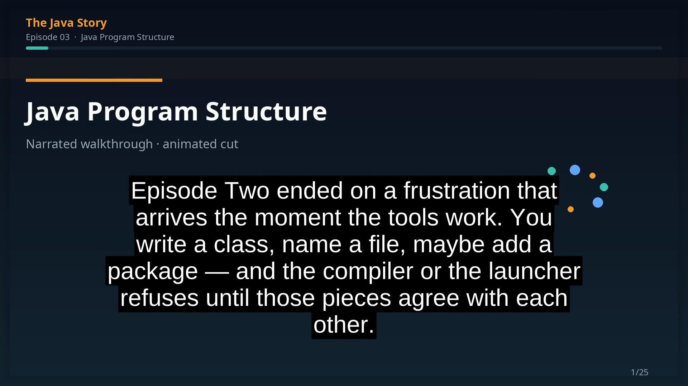

# Episode 03 — Java Program Structure

**Cut:** `v2` · **Series:** The Java Story

## Files

- [`thumbnail.jpg`](thumbnail.jpg) — episode thumbnail
- [`Java_Episode_03_Java_Program_Structure.mp4`](Java_Episode_03_Java_Program_Structure.mp4) — clean video
- [`Java_Episode_03_Java_Program_Structure_CAPTIONED.mp4`](Java_Episode_03_Java_Program_Structure_CAPTIONED.mp4) — captioned video
- [`Java_Episode_03.srt`](Java_Episode_03.srt) — captions (SRT)
- [`Java_Episode_03_SOURCE.md`](Java_Episode_03_SOURCE.md) — build provenance
- [`narration.md`](narration.md) — narration used for this render

## Navigation

- Previous: [Episode 02 — JDK, JRE, and JVM](../ep02-jdk-jre-and-jvm/)
- Next: [Episode 04 — Variables and Data Types](../ep04-variables-and-data-types/)
- Index: [`../../INDEX.md`](../../INDEX.md)
