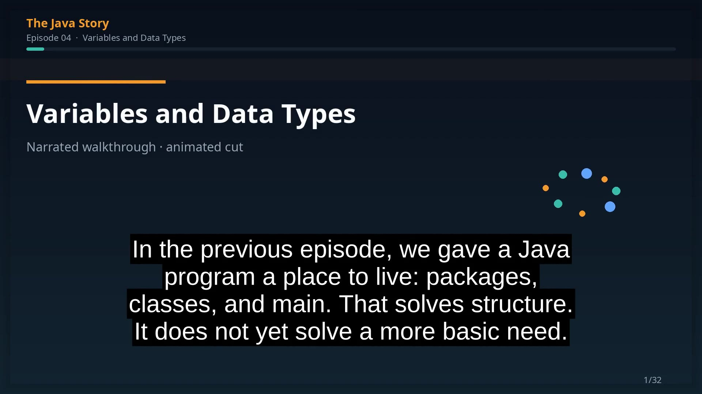

# Episode 04 — Variables and Data Types

**Cut:** `v2` · **Series:** The Java Story

## Files

- [`thumbnail.jpg`](thumbnail.jpg) — episode thumbnail
- [`Java_Episode_04_Variables_and_Data_Types.mp4`](Java_Episode_04_Variables_and_Data_Types.mp4) — clean video
- [`Java_Episode_04_Variables_and_Data_Types_CAPTIONED.mp4`](Java_Episode_04_Variables_and_Data_Types_CAPTIONED.mp4) — captioned video
- [`Java_Episode_04.srt`](Java_Episode_04.srt) — captions (SRT)
- [`Java_Episode_04_SOURCE.md`](Java_Episode_04_SOURCE.md) — build provenance
- [`narration.md`](narration.md) — narration used for this render

## Navigation

- Previous: [Episode 03 — Java Program Structure](../ep03-java-program-structure/)
- Next: [Episode 05 — Operators](../ep05-operators/)
- Index: [`../../INDEX.md`](../../INDEX.md)
