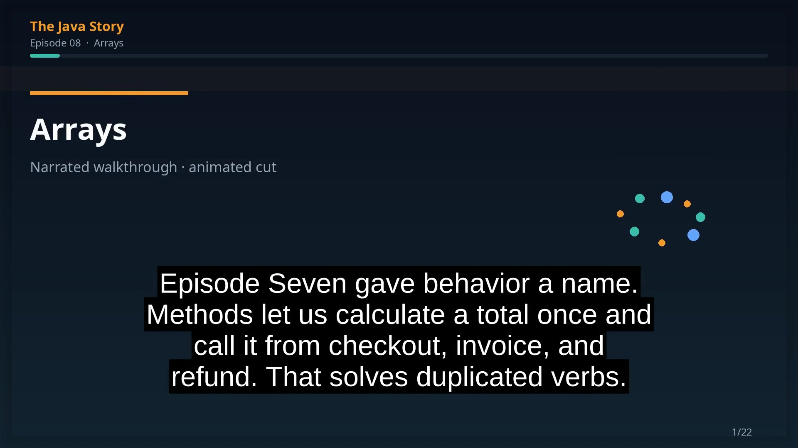

# Episode 08 — Arrays

**Cut:** `v2` · **Series:** The Java Story

## Files

- [`thumbnail.jpg`](thumbnail.jpg) — episode thumbnail
- [`Java_Episode_08_Arrays.mp4`](Java_Episode_08_Arrays.mp4) — clean video
- [`Java_Episode_08_Arrays_CAPTIONED.mp4`](Java_Episode_08_Arrays_CAPTIONED.mp4) — captioned video
- [`Java_Episode_08.srt`](Java_Episode_08.srt) — captions (SRT)
- [`Java_Episode_08_SOURCE.md`](Java_Episode_08_SOURCE.md) — build provenance
- [`narration.md`](narration.md) — narration used for this render

## Navigation

- Previous: [Episode 07 — Methods](../ep07-methods/)
- Next: [Episode 09 — Strings](../ep09-strings/)
- Index: [`../../INDEX.md`](../../INDEX.md)
