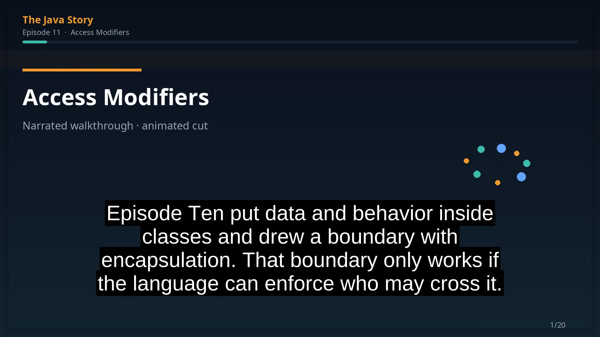

# Episode 11 — Access Modifiers

**Cut:** `v2` · **Series:** The Java Story

## Files

- [`thumbnail.jpg`](thumbnail.jpg) — episode thumbnail
- [`Java_Episode_11_Access_Modifiers.mp4`](Java_Episode_11_Access_Modifiers.mp4) — clean video
- [`Java_Episode_11_Access_Modifiers_CAPTIONED.mp4`](Java_Episode_11_Access_Modifiers_CAPTIONED.mp4) — captioned video
- [`Java_Episode_11.srt`](Java_Episode_11.srt) — captions (SRT)
- [`Java_Episode_11_SOURCE.md`](Java_Episode_11_SOURCE.md) — build provenance
- [`narration.md`](narration.md) — narration used for this render

## Navigation

- Previous: [Episode 10 — Object-Oriented Programming](../ep10-object-oriented-programming/)
- Next: [Episode 12 — Packages](../ep12-packages/)
- Index: [`../../INDEX.md`](../../INDEX.md)
