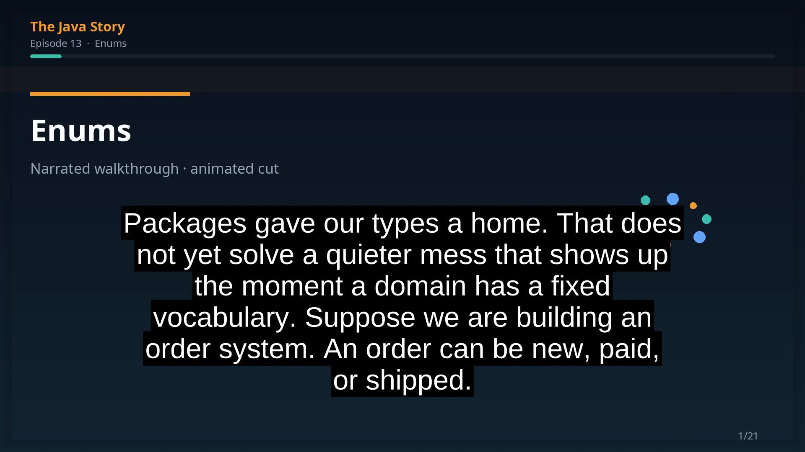

# Episode 13 — Enums

**Cut:** `v2` · **Series:** The Java Story

## Files

- [`thumbnail.jpg`](thumbnail.jpg) — episode thumbnail
- [`Java_Episode_13_Enums.mp4`](Java_Episode_13_Enums.mp4) — clean video
- [`Java_Episode_13_Enums_CAPTIONED.mp4`](Java_Episode_13_Enums_CAPTIONED.mp4) — captioned video
- [`Java_Episode_13.srt`](Java_Episode_13.srt) — captions (SRT)
- [`Java_Episode_13_SOURCE.md`](Java_Episode_13_SOURCE.md) — build provenance
- [`narration.md`](narration.md) — narration used for this render

## Navigation

- Previous: [Episode 12 — Packages](../ep12-packages/)
- Next: [Episode 14 — Wrappers and Autoboxing](../ep14-wrappers-and-autoboxing/)
- Index: [`../../INDEX.md`](../../INDEX.md)
