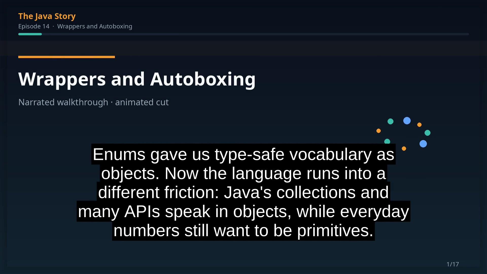

# Episode 14 — Wrappers and Autoboxing

**Cut:** `v2` · **Series:** The Java Story

## Files

- [`thumbnail.jpg`](thumbnail.jpg) — episode thumbnail
- [`Java_Episode_14_Wrappers_and_Autoboxing.mp4`](Java_Episode_14_Wrappers_and_Autoboxing.mp4) — clean video
- [`Java_Episode_14_Wrappers_and_Autoboxing_CAPTIONED.mp4`](Java_Episode_14_Wrappers_and_Autoboxing_CAPTIONED.mp4) — captioned video
- [`Java_Episode_14.srt`](Java_Episode_14.srt) — captions (SRT)
- [`Java_Episode_14_SOURCE.md`](Java_Episode_14_SOURCE.md) — build provenance
- [`narration.md`](narration.md) — narration used for this render

## Navigation

- Previous: [Episode 13 — Enums](../ep13-enums/)
- Next: [Episode 15 — Generics](../ep15-generics/)
- Index: [`../../INDEX.md`](../../INDEX.md)
