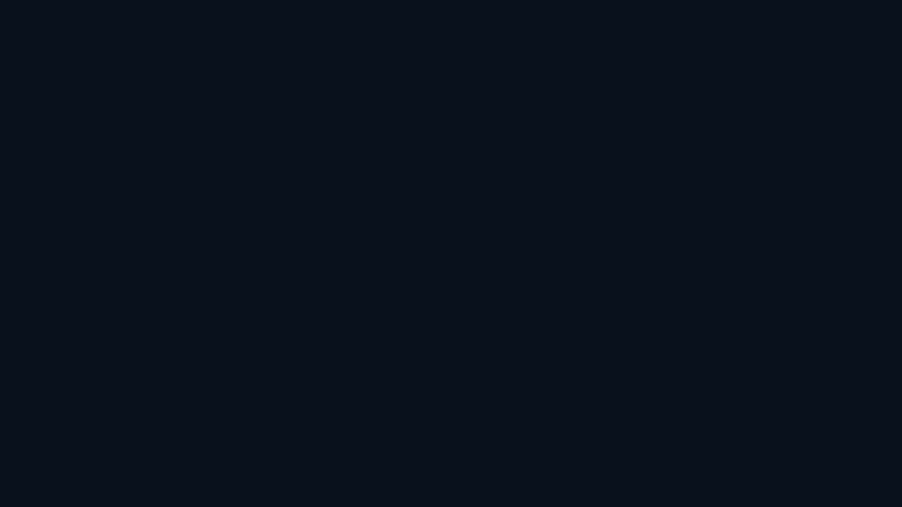

# Episode 22 — Sets

**Cut:** `v2` · **Series:** The Java Story

## Files

- [`thumbnail.jpg`](thumbnail.jpg) — episode thumbnail
- [`Java_Episode_22_Sets.mp4`](Java_Episode_22_Sets.mp4) — clean video
- [`Java_Episode_22_Sets_CAPTIONED.mp4`](Java_Episode_22_Sets_CAPTIONED.mp4) — captioned video
- [`Java_Episode_22.srt`](Java_Episode_22.srt) — captions (SRT)
- [`Java_Episode_22_SOURCE.md`](Java_Episode_22_SOURCE.md) — build provenance
- [`narration.md`](narration.md) — narration used for this render

## Navigation

- Previous: [Episode 21 — Lists](../ep21-lists/)
- Next: [Episode 23 — Maps](../ep23-maps/)
- Index: [`../../INDEX.md`](../../INDEX.md)
