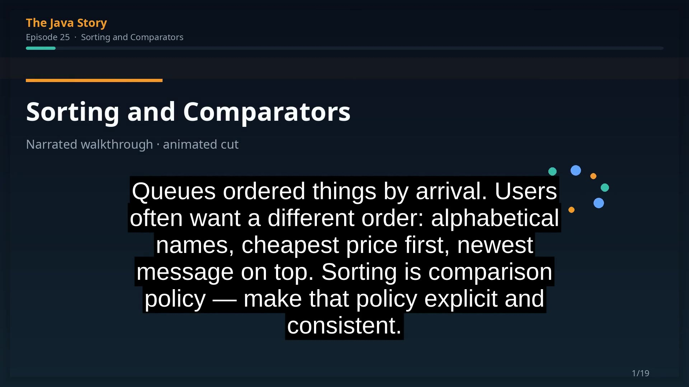

# Episode 25 — Sorting and Comparators

**Cut:** `v2` · **Series:** The Java Story

## Files

- [`thumbnail.jpg`](thumbnail.jpg) — episode thumbnail
- [`Java_Episode_25_Sorting_and_Comparators.mp4`](Java_Episode_25_Sorting_and_Comparators.mp4) — clean video
- [`Java_Episode_25_Sorting_and_Comparators_CAPTIONED.mp4`](Java_Episode_25_Sorting_and_Comparators_CAPTIONED.mp4) — captioned video
- [`Java_Episode_25.srt`](Java_Episode_25.srt) — captions (SRT)
- [`Java_Episode_25_SOURCE.md`](Java_Episode_25_SOURCE.md) — build provenance
- [`narration.md`](narration.md) — narration used for this render

## Navigation

- Previous: [Episode 24 — Queues and Deques](../ep24-queues-and-deques/)
- Next: [Episode 26 — Streams Intro](../ep26-streams-intro/)
- Index: [`../../INDEX.md`](../../INDEX.md)
