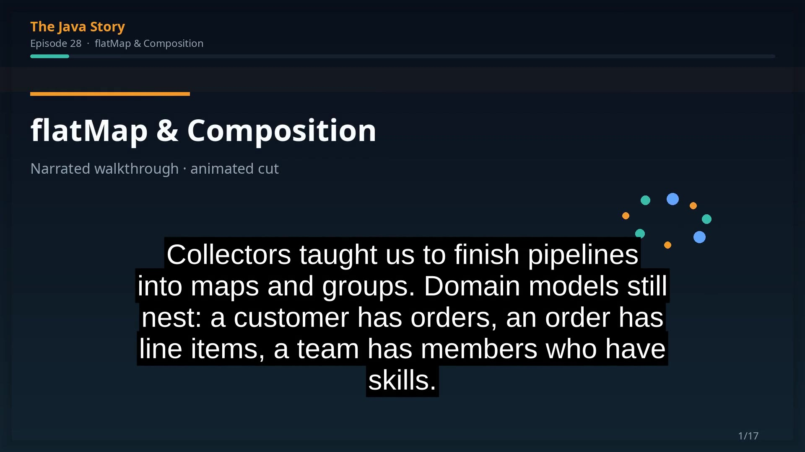

# Episode 28 — flatMap & Composition

**Cut:** `v2` · **Series:** The Java Story

## Files

- [`thumbnail.jpg`](thumbnail.jpg) — episode thumbnail
- [`Java_Episode_28_flatMap_Composition.mp4`](Java_Episode_28_flatMap_Composition.mp4) — clean video
- [`Java_Episode_28_flatMap_Composition_CAPTIONED.mp4`](Java_Episode_28_flatMap_Composition_CAPTIONED.mp4) — captioned video
- [`Java_Episode_28.srt`](Java_Episode_28.srt) — captions (SRT)
- [`Java_Episode_28_SOURCE.md`](Java_Episode_28_SOURCE.md) — build provenance
- [`narration.md`](narration.md) — narration used for this render

## Navigation

- Previous: [Episode 27 — Stream Collectors](../ep27-stream-collectors/)
- Next: [Episode 29 — Parallel Streams](../ep29-parallel-streams/)
- Index: [`../../INDEX.md`](../../INDEX.md)
