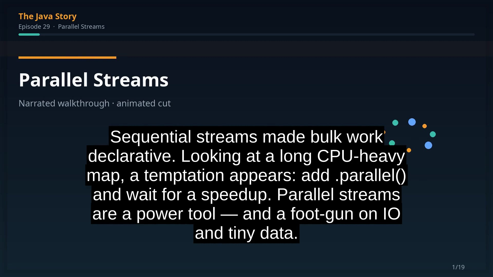

# Episode 29 — Parallel Streams

**Cut:** `v2` · **Series:** The Java Story

## Files

- [`thumbnail.jpg`](thumbnail.jpg) — episode thumbnail
- [`Java_Episode_29_Parallel_Streams.mp4`](Java_Episode_29_Parallel_Streams.mp4) — clean video
- [`Java_Episode_29_Parallel_Streams_CAPTIONED.mp4`](Java_Episode_29_Parallel_Streams_CAPTIONED.mp4) — captioned video
- [`Java_Episode_29.srt`](Java_Episode_29.srt) — captions (SRT)
- [`Java_Episode_29_SOURCE.md`](Java_Episode_29_SOURCE.md) — build provenance
- [`narration.md`](narration.md) — narration used for this render

## Navigation

- Previous: [Episode 28 — flatMap & Composition](../ep28-flatmap-composition/)
- Next: [Episode 30 — Optional](../ep30-optional/)
- Index: [`../../INDEX.md`](../../INDEX.md)
