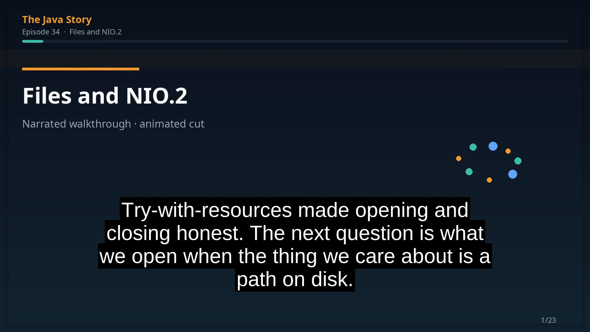

# Episode 34 — Files and NIO.2

**Cut:** `v2` · **Series:** The Java Story

## Files

- [`thumbnail.jpg`](thumbnail.jpg) — episode thumbnail
- [`Java_Episode_34_Files_and_NIO_2.mp4`](Java_Episode_34_Files_and_NIO_2.mp4) — clean video
- [`Java_Episode_34_Files_and_NIO_2_CAPTIONED.mp4`](Java_Episode_34_Files_and_NIO_2_CAPTIONED.mp4) — captioned video
- [`Java_Episode_34.srt`](Java_Episode_34.srt) — captions (SRT)
- [`Java_Episode_34_SOURCE.md`](Java_Episode_34_SOURCE.md) — build provenance
- [`narration.md`](narration.md) — narration used for this render

## Navigation

- Previous: [Episode 33 — try-with-resources](../ep33-try-with-resources/)
- Next: [Episode 35 — Readers and Writers](../ep35-readers-and-writers/)
- Index: [`../../INDEX.md`](../../INDEX.md)
