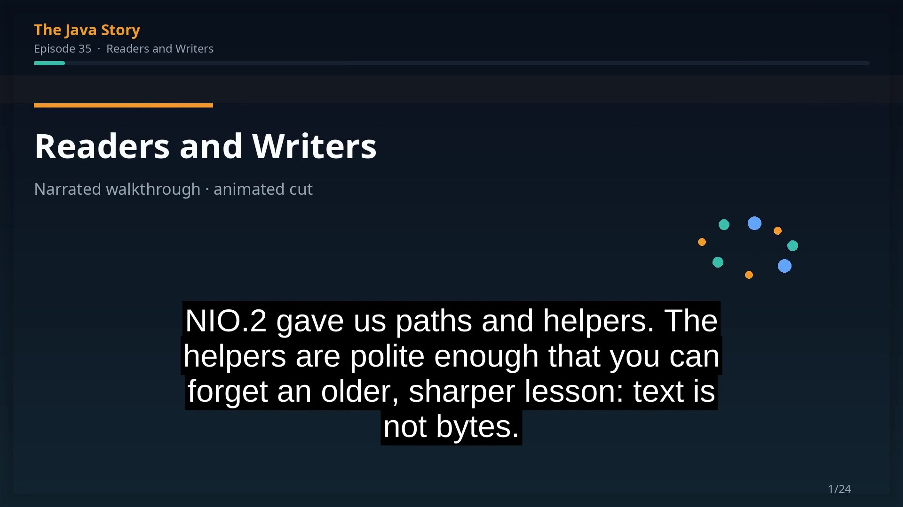

# Episode 35 — Readers and Writers

**Cut:** `v2` · **Series:** The Java Story

## Files

- [`thumbnail.jpg`](thumbnail.jpg) — episode thumbnail
- [`Java_Episode_35_Readers_and_Writers.mp4`](Java_Episode_35_Readers_and_Writers.mp4) — clean video
- [`Java_Episode_35_Readers_and_Writers_CAPTIONED.mp4`](Java_Episode_35_Readers_and_Writers_CAPTIONED.mp4) — captioned video
- [`Java_Episode_35.srt`](Java_Episode_35.srt) — captions (SRT)
- [`Java_Episode_35_SOURCE.md`](Java_Episode_35_SOURCE.md) — build provenance
- [`narration.md`](narration.md) — narration used for this render

## Navigation

- Previous: [Episode 34 — Files and NIO.2](../ep34-files-and-nio-2/)
- Next: [Episode 36 — Threads Intro](../ep36-threads-intro/)
- Index: [`../../INDEX.md`](../../INDEX.md)
