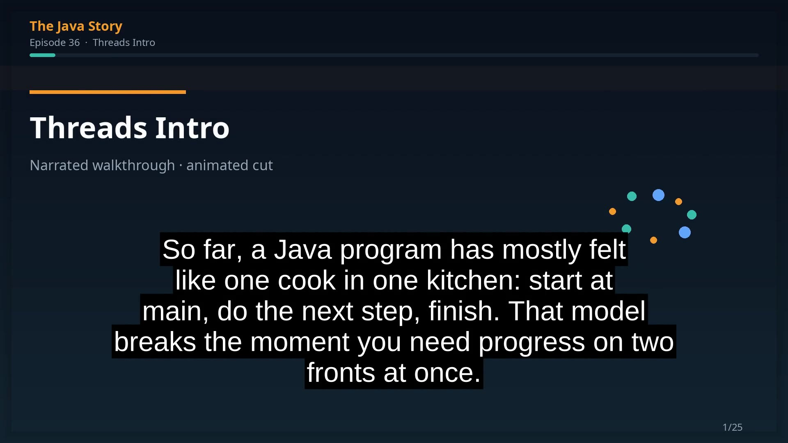

# Episode 36 — Threads Intro

**Cut:** `v2` · **Series:** The Java Story

## Files

- [`thumbnail.jpg`](thumbnail.jpg) — episode thumbnail
- [`Java_Episode_36_Threads_Intro.mp4`](Java_Episode_36_Threads_Intro.mp4) — clean video
- [`Java_Episode_36_Threads_Intro_CAPTIONED.mp4`](Java_Episode_36_Threads_Intro_CAPTIONED.mp4) — captioned video
- [`Java_Episode_36.srt`](Java_Episode_36.srt) — captions (SRT)
- [`Java_Episode_36_SOURCE.md`](Java_Episode_36_SOURCE.md) — build provenance
- [`narration.md`](narration.md) — narration used for this render

## Navigation

- Previous: [Episode 35 — Readers and Writers](../ep35-readers-and-writers/)
- Next: [Episode 37 — Synchronization](../ep37-synchronization/)
- Index: [`../../INDEX.md`](../../INDEX.md)
