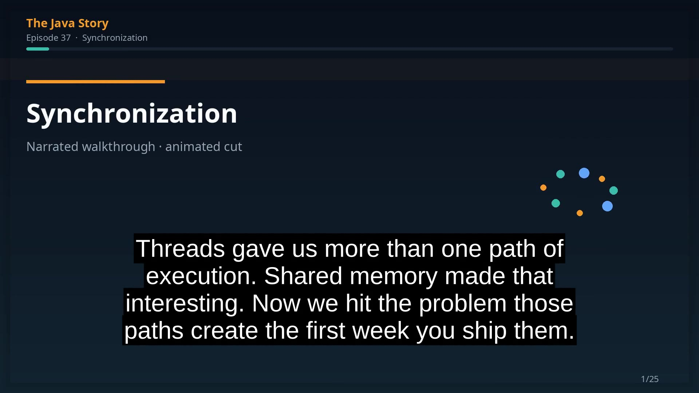

# Episode 37 — Synchronization

**Cut:** `v2` · **Series:** The Java Story

## Files

- [`thumbnail.jpg`](thumbnail.jpg) — episode thumbnail
- [`Java_Episode_37_Synchronization.mp4`](Java_Episode_37_Synchronization.mp4) — clean video
- [`Java_Episode_37_Synchronization_CAPTIONED.mp4`](Java_Episode_37_Synchronization_CAPTIONED.mp4) — captioned video
- [`Java_Episode_37.srt`](Java_Episode_37.srt) — captions (SRT)
- [`Java_Episode_37_SOURCE.md`](Java_Episode_37_SOURCE.md) — build provenance
- [`narration.md`](narration.md) — narration used for this render

## Navigation

- Previous: [Episode 36 — Threads Intro](../ep36-threads-intro/)
- Next: [Episode 38 — volatile and Happens-Before](../ep38-volatile-and-happens-before/)
- Index: [`../../INDEX.md`](../../INDEX.md)
