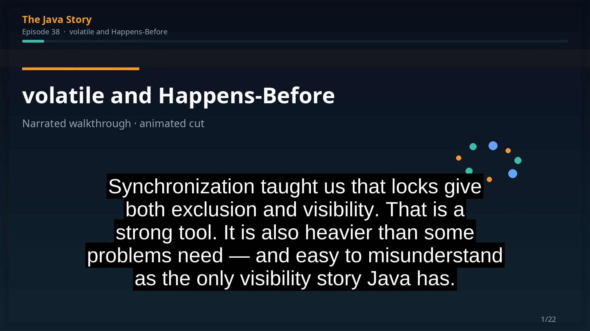

# Episode 38 — volatile and Happens-Before

**Cut:** `v2` · **Series:** The Java Story

## Files

- [`thumbnail.jpg`](thumbnail.jpg) — episode thumbnail
- [`Java_Episode_38_volatile_and_Happens_Before.mp4`](Java_Episode_38_volatile_and_Happens_Before.mp4) — clean video
- [`Java_Episode_38_volatile_and_Happens_Before_CAPTIONED.mp4`](Java_Episode_38_volatile_and_Happens_Before_CAPTIONED.mp4) — captioned video
- [`Java_Episode_38.srt`](Java_Episode_38.srt) — captions (SRT)
- [`Java_Episode_38_SOURCE.md`](Java_Episode_38_SOURCE.md) — build provenance
- [`narration.md`](narration.md) — narration used for this render

## Navigation

- Previous: [Episode 37 — Synchronization](../ep37-synchronization/)
- Next: [Episode 39 — Explicit Locks](../ep39-explicit-locks/)
- Index: [`../../INDEX.md`](../../INDEX.md)
