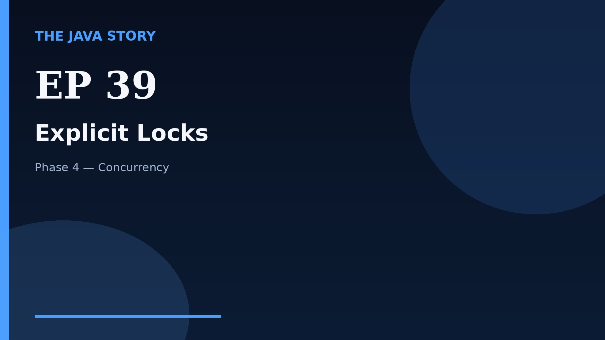

# Episode 39 — Explicit Locks

**Cut:** `v2` · **YouTube upload pack**

## YouTube upload checklist

| Asset | File |
|---|---|
| Title | [`title.txt`](title.txt) |
| Description + timestamps | [`youtube_description.txt`](youtube_description.txt) |
| Tags | [`tags.txt`](tags.txt) |
| Thumbnail | [`thumbnail.jpg`](thumbnail.jpg) |
| Video (clean) | [`Java_Episode_39_Explicit_Locks.mp4`](Java_Episode_39_Explicit_Locks.mp4) |
| Video (captioned) | [`Java_Episode_39_Explicit_Locks_CAPTIONED.mp4`](Java_Episode_39_Explicit_Locks_CAPTIONED.mp4) |
| Captions (SRT) | [`Java_Episode_39.srt`](Java_Episode_39.srt) |
| Narration / transcript | [`narration.md`](narration.md) |
| Build provenance | [`Java_Episode_39_SOURCE.md`](Java_Episode_39_SOURCE.md) |

## Suggested upload

1. Upload **clean** video (or captioned if you want burned-in subs).
2. Set title from `title.txt`.
3. Paste `youtube_description.txt` into YouTube description.
4. Upload `thumbnail.jpg`.
5. Upload `*.srt` as captions (if using clean video).
6. Add tags from `tags.txt`.

## Navigation

- Previous: [ep38-volatile-and-happens-before](../ep38-volatile-and-happens-before/)
- Next: [ep40-executorservice](../ep40-executorservice/)
- Index: [`../../INDEX.md`](../../INDEX.md)
