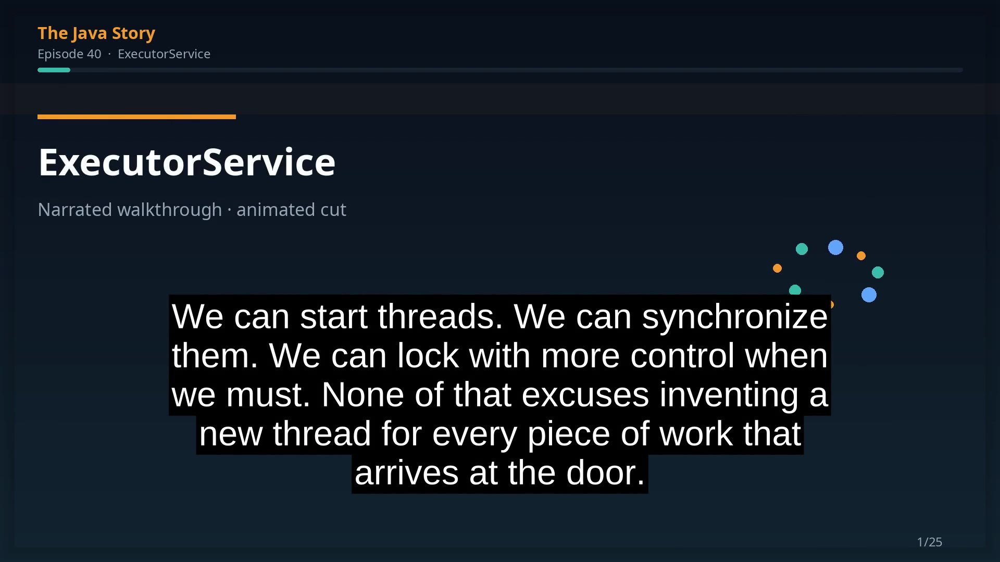

# Episode 40 — ExecutorService

**Cut:** `v2` · **Series:** The Java Story

## Files

- [`thumbnail.jpg`](thumbnail.jpg) — episode thumbnail
- [`Java_Episode_40_ExecutorService.mp4`](Java_Episode_40_ExecutorService.mp4) — clean video
- [`Java_Episode_40_ExecutorService_CAPTIONED.mp4`](Java_Episode_40_ExecutorService_CAPTIONED.mp4) — captioned video
- [`Java_Episode_40.srt`](Java_Episode_40.srt) — captions (SRT)
- [`Java_Episode_40_SOURCE.md`](Java_Episode_40_SOURCE.md) — build provenance
- [`narration.md`](narration.md) — narration used for this render

## Navigation

- Previous: [Episode 39 — Explicit Locks](../ep39-explicit-locks/)
- Next: [Episode 41 — Callable and Future](../ep41-callable-and-future/)
- Index: [`../../INDEX.md`](../../INDEX.md)
