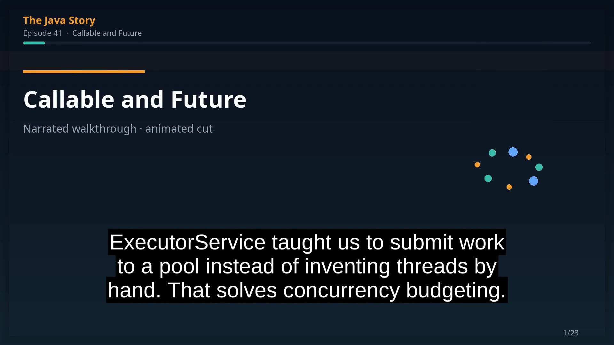

# Episode 41 — Callable and Future

**Cut:** `v2` · **Series:** The Java Story

## Files

- [`thumbnail.jpg`](thumbnail.jpg) — episode thumbnail
- [`Java_Episode_41_Callable_and_Future.mp4`](Java_Episode_41_Callable_and_Future.mp4) — clean video
- [`Java_Episode_41_Callable_and_Future_CAPTIONED.mp4`](Java_Episode_41_Callable_and_Future_CAPTIONED.mp4) — captioned video
- [`Java_Episode_41.srt`](Java_Episode_41.srt) — captions (SRT)
- [`Java_Episode_41_SOURCE.md`](Java_Episode_41_SOURCE.md) — build provenance
- [`narration.md`](narration.md) — narration used for this render

## Navigation

- Previous: [Episode 40 — ExecutorService](../ep40-executorservice/)
- Next: [Episode 42 — Concurrent Collections](../ep42-concurrent-collections/)
- Index: [`../../INDEX.md`](../../INDEX.md)
